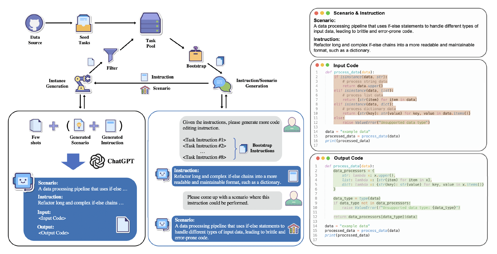

# InstructCoder: Empowering Language Models for Code Editing




# Overview
InstructCoder is the first dataset designed to adapt LLMs for general code editing. It consists of over 114,000 instruction-input-output triplets and covers multiple distinct code editing scenarios, generated by ChatGPT. 

**Please check out [our blog](https://blog.nus.edu.sg/kaixinli/2023/05/23/codeinstruct/) with more details.**

**You can also read [our paper](https://arxiv.org/abs/2310.20329).**

# Data Collection
To generate instructional data for code editing, we employed a similar method based on [Self-Instruct](https://github.com/yizhongw/self-instruct). This methodology of generating training data using LLMs requires minimal human-labeled data as seed tasks while still maintaining the quality and relevance of the tasks in the dataset. InstructCoder is systematically expanded through an iterative process that commences with editing data sourced from GitHub commits as seed tasks. Seed and generated tasks are used subsequently bootstrapped to prompt ChatGPT for more task data. 

For each generated instruction, we also prompt ChatGPT to generate a list of practical events as 'real-world' scenarios where the editing instruction could be performed, and randomly select one for subsequent generation. During instance generation, ChatGPT is instructed to generate examples that correspond with the operation in the instruction while ensuring the codebases and variable names are appropriate for the given scenario. We observe that instances generated with the inclusion of a scenario demonstrate higher quality in terms of richer context and code structure compared to those without. 


# Results and Examples
The largest model fine-tuned, LLaMA-33B, performs on par with ChatGPT, with 79.3% accuracy on the test set. Some qualitative examples generated by our model are shown [here](#examples).


# Release
We are planning to release the following assets:
- [x] Full dataset: Over 114,000 code-editing instructional data.
- [x] Train / Validation data: Arround 95% / 5% of the full dataset.
- [x] Test data: 134 github commit data.
- [x] Github seed data: A total of 634 github commit data.
- [x] Additional seed data: 592 unused generated samples.
- [x] Source code for generating data
- [ ] TODO: Checkpoints

We are currently working on a clean release of our code. We will upload the code as soon as we finish the job.

We also plan to release our LoRA checkpoints [here](https://huggingface.co/happylkx).


# Examples

1. Instruction: Transform the code into a class method called 'calculate_distance' that calculates the distance between two points in 3D space.

Input code:
```python
import math

def distance(point1, point2):
    x1, y1, z1 = point1
    x2, y2, z2 = point2
    dx = x2 - x1
    dy = y2 - y1
    dz = z2 - z1
    return math.sqrt(dx**2 + dy**2 + dz**2)

point1 = (0, 0, 0)
point2 = (1, 1, 1)
print(distance(point1, point2))
```

Output code:
```python
import math

class Point:
    def __init__(self, x, y, z):
        self.x = x
        self.y = y
        self.z = z

    def calculate_distance(self, other_point):
        dx = other_point.x - self.x
        dy = other_point.y - self.y
        dz = other_point.z - self.z
        return math.sqrt(dx**2 + dy**2 + dz**2)

point1 = Point(0, 0, 0)
point2 = Point(1, 1, 1)
print(point1.calculate_distance(point2))
```

2. Instruction: Integrate error handling into the code that performs batch processing of large datasets, including job failures or incomplete runs.

Input code:
```python
import pandas as pd

def process_orders(orders_file, shipping_file, inventory_file):
    orders = pd.read_csv(orders_file)
    shipping = pd.read_csv(shipping_file)
    inventory = pd.read_csv(inventory_file)

    # Perform data processing and analysis here...

    results = {"success": True, "message": "Batch processing completed successfully."}
    return results

orders_file = "orders.csv"
shipping_file = "shipping.csv"
inventory_file = "inventory.csv"

results = process_orders(orders_file, shipping_file, inventory_file)
print(results)
```

Output code:
```python
import pandas as pd
import logging

logging.basicConfig(filename='batch_processing.log', level=logging.ERROR)

def process_orders(orders_file, shipping_file, inventory_file):
    try:
        orders = pd.read_csv(orders_file)
        shipping = pd.read_csv(shipping_file)
        inventory = pd.read_csv(inventory_file)

        # Perform data processing and analysis here...

        results = {"success": True, "message": "Batch processing completed successfully."}
        return results
    except Exception as e:
        logging.error(f"Error processing batch: {e}")
        results = {"success": False, "message": "Batch processing failed. Please check the input files for any issues."}
        return results

orders_file = "orders.csv"
shipping_file = "shipping.csv"
inventory_file = "inventory.csv"

results = process_orders(orders_file, shipping_file, inventory_file)
print(results)
```

2. Instruction: Refactor any code that uses 'exec' or 'eval' for security reasons.

Input code:
```python
game_data = {
    "score": 0,
    "level": 1
}

def execute_script(script):
    exec(script)

script = """
game_data["score"] += 10
if game_data["score"] >= 100:
    game_data["level"] += 1
"""

execute_script(script)
print(game_data)
```

Output code:
```python
game_data = {
    "score": 0,
    "level": 1
}

def execute_script(script):
    compiled_script = compile(script, "", "exec")
    exec(compiled_script, game_data)

script = """
game_data["score"] += 10
if game_data["score"] >= 100:
    game_data["level"] += 1
"""

execute_script(script)
print(game_data)
```
Now the script is not able to access the data in `game_data`.


# Citation
Feel free to cite this work if you use the data or code in this repo.
```bibtex
@misc{hu2023instructcoder,
      title={InstructCoder: Empowering Language Models for Code Editing}, 
      author={Qisheng Hu and Kaixin Li and Xu Zhao and Yuxi Xie and Tiedong Liu and Hui Chen and Qizhe Xie and Junxian He},
      year={2023},
      eprint={2310.20329},
      archivePrefix={arXiv},
      primaryClass={cs.CL}
}
```